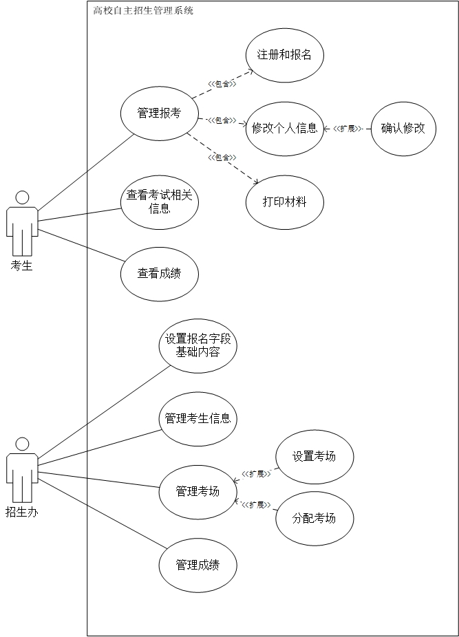

# 软件需求说明书

## 2 项目概述

### 2.1 软件系统描述

本项目是一个自主招生管理系统的子系统，仅包括网上报名和后台管理两部分，并且仅针对一个学校的需求进行定制，非平台式应用。本系统主要用于高校自主招生考试，用户包括学校的招生办和考生，方便考生进行网上报名、维护个人信息、查询考试信息、查询考试成绩等；同时对于高考招生办来说，提供了便捷的后台管理操作，简化其招生流程，便于收集学生的信息、统筹考试安排、统计考生信息等。

### 2.2 用户群体

本系统最终用户为某校招生办和报考该校自主招生的高中生，其中高中生仅限高中三年级的应届生。考生用户群体的计算机使用水平不可控，且无法进行培训；招生办要求具备一定的计算机使用水平，可进行培训。本系统的预期使用频率仅在考试前后较高，对于考生来说平均约为3次/天，对于招生办老师来说约为100次/天。

### 2.3 功能描述

本系统可简化为两个子系统：面向考生的报名系统和后台的管理系统。管理系统又包括设置报考信息的填写内容、发布信息、批量管理考生信息等内容。

报名系统开启前，先由招生办的老师设定好各字段的内容，然后开放报名之后由考生按照要求进行填写，报名完成之后，考生会自动获得一个报名号；考生可以凭报名号或用户名登陆该系统，登陆后可以查看系统通知、维护个人信息、打印报名材料等；招生办老师在后台可以看到所有考生的信息，可以进行批量导出，也可以选择一些字段进行批量导出；招生办老师可以批量给考生分配考场、安排考试时间，考生可以在自己的信息页面中查到考场信息和考试时间；招生办老师可以发布通知，考生可以在报名网站主页上看到通知。招办老师可以批量录入考生成绩，考生可在自己信息页面上查询到自己的成绩。

## 3 功能需求

### 3.1 用况图

### 3.2 用况描述

| 用况编号：1 | 作者：温九                                    |
| ------ | ---------------------------------------- |
| 用况名    | 管理报考                                     |
| 参与者    | 考生                                       |
| 相关用况   | 注册和报名、修改个人信息、打印资料                        |
| 前置条件   | 考生成功登陆系统                                 |
| 后置条件   | 系统中更新考生填写并保存的信息                          |
| 基本路径   | (1) 考生进入报名界面或个人信息界面  (2) 考生填写报名表或修改个人信息  (3) 考生可选择打印材料  (4) 点击保存退出 |

| 用况编号：1.1 | 作者：温九                                    |
| -------- | ---------------------------------------- |
| 用况名      | 注册和报名                                    |
| 参与者      | 考生                                       |
| 相关用况     | 管理报考                                     |
| 前置条件     | 考生进入注册页面                                 |
| 后置条件     | 系统中更新考生的注册报名信息                           |
| 基本路径     | (1) 考生进入报名界面  (2) 考生填写报名表  (3) 提交报名信息，获得报名号 |

| 用况编号：1.2 | 作者：温九                                    |
| -------- | ---------------------------------------- |
| 用况名      | 修改个人信息                                   |
| 参与者      | 考生                                       |
| 相关用况     | 管理报考                                     |
| 前置条件     | 考生成功登陆管理个人信息界面；考生没有确认修改                  |
| 后置条件     | 系统中更新考生的注册报名信息                           |
| 基本路径     | (1) 考生进入个人信息界面  (2) 考生点击修改信息  (3) 提交修改 |

| 用况编号：1.3 | 作者：温九                                    |
| -------- | ---------------------------------------- |
| 用况名      | 打印材料                                     |
| 参与者      | 考生                                       |
| 相关用况     | 管理报考                                     |
| 前置条件     | 考生登陆系统查看个人信息界面                           |
| 后置条件     | 成功打印                                     |
| 基本路径     | (1) 考生进入个人信息界面  (2) 考生选择要打印的内容，包括报名表、准考证等，点击打印  (3) 成功打印 |

| 用况编号：1.2.1 | 作者：温九                                    |
| ---------- | ---------------------------------------- |
| 用况名        | 确认修改                                     |
| 参与者        | 考生                                       |
| 相关用况       | 修改个人信息                                   |
| 前置条件       | 完成个人信息的修改，确认无误                           |
| 后置条件       | 系统中确认考生信息已经保存且不可再修改                      |
| 基本路径       | (1) 考生进入个人信息界面  (2) 考生确认信息填写无误  (3) 考生选择确认修改 |

| 用况编号：2 | 作者：温九                                    |
| ------ | ---------------------------------------- |
| 用况名    | 查看考试相关信息                                 |
| 参与者    | 考生                                       |
| 相关用况   |                                          |
| 前置条件   | 考生登陆系统                                   |
| 后置条件   |                                          |
| 基本路径   | (1) 考生登陆系统  (2) 考生选择查看公告或查看个人考场安排和考试时间 |

| 用况编号：3 | 作者：温九                                 |
| ------ | ------------------------------------- |
| 用况名    | 查看成绩                                  |
| 参与者    | 考生                                    |
| 相关用况   |                                       |
| 前置条件   | 考生登陆系统；成绩已录入系统                        |
| 后置条件   |                                       |
| 基本路径   | (1) 考生登陆系统  (2) 考生进入查看个人信息页面查看考试成绩 |

| 用况编号：4 | 作者：温九                                    |
| ------ | ---------------------------------------- |
| 用况名    | 设置报名字段基础内容                               |
| 参与者    | 招生办                                      |
| 相关用况   |                                          |
| 前置条件   | 以管理员身份登陆系统                               |
| 后置条件   | 自主招生网站的基础信息被成功设置                         |
| 基本路径   | (1) 教务登陆系统  (2) 对每个字段所包含的信息进行填写  (3) 进行小类设置、科目设置、系统设置  (4) 进行一些指示性文字填写  (5) 系统显示更新后的基础信息 |

| 用况编号：5 | 作者：温九                                    |
| ------ | ---------------------------------------- |
| 用况名    | 管理考生信息                                   |
| 参与者    | 招生办                                      |
| 相关用况   |                                          |
| 前置条件   | 以管理员身份登陆系统                               |
| 后置条件   | 成功导出考生信息                                 |
| 基本路径   | (1) 登陆系统  (2) 查看已经确认的考生信息  (3) 选择要导出的字段  (4)批量导出考生信息 |

| 用况编号：6 | 作者：温九                                    |
| ------ | ---------------------------------------- |
| 用况名    | 管理考场                                     |
| 参与者    | 招生办                                      |
| 相关用况   | 分配考场、设置考场                                |
| 前置条件   | 以管理员身份登陆系统                               |
| 后置条件   | 完成考场的设置                                  |
| 基本路径   | (1) 教务登陆系统  (2) 查看考场信息  (3) 对考场进行管理 |

| 用况编号：6.1 | 作者：温九                                    |
| -------- | ---------------------------------------- |
| 用况名      | 设置考场                                     |
| 参与者      | 招生办                                      |
| 相关用况     | 管理考场                                     |
| 前置条件     | 以管理员身份登陆                                 |
| 后置条件     | 完成考场的设置                                  |
| 基本路径     | (1) 教务查看考场信息  (2) 选择一个考场，对其容纳人数、监考人员等进行设置  (3) 添加/删除一个考场 |

| 用况编号：6.2 | 作者：温九                                    |
| -------- | ---------------------------------------- |
| 用况名      | 分配考场                                     |
| 参与者      | 招生办                                      |
| 相关用况     | 管理考场                                     |
| 前置条件     | 以管理员身份登陆                                 |
| 后置条件     | 完成考场的分配                                  |
| 基本路径     | (1) 教务查看考场信息和报考学生信息  (2) 教务批量选择学生，系统自动为其分配考场  (3) 教务可对单个学生的考场进行修改和设置 |

| 用况编号：7 | 作者：温九                                    |
| ------ | ---------------------------------------- |
| 用况名    | 管理成绩                                     |
| 参与者    | 招生办                                      |
| 相关用况   | 查看成绩                                     |
| 前置条件   | 以管理员身份登陆                                 |
| 后置条件   | 系统中增加新的考生成绩                              |
| 基本路径   | (1) 校内教务选择导入成绩  (2) 系统要求教务选择导入的文件  (3) 考务选择要导入的文件完成导入  (4) 考务选择继续导入或退出  (5) 如果选择继续导入则跳转到(2) |

## 4 非功能需求

### 4.1 性能需求

* 最少可支持并行操作的用户数为100
* 正常情况下每日处理的数据总量为500以上
* 峰值工作条件下满足每日处理的数据总量为2000以上
* 网络正常情况下，对于考生的操作平均响应时间应该在1s以内，对于考务的响应时间在2s以内

### 4.2 外部接口需求 

#### 4.2.1 用户接口

用户界面采用符合Material Design的设计，为重要的任务管理功能提供导航，尊崇美观大方简洁的设计理念，保证不同计算机水平的用户都能无障碍地使用。用户接口地更多细节将在概要设计说明书中描述。

#### 4.2.2 硬件接口

无

#### 4.2.3 软件接口

* 浏览器：需要能与IE9+、Chrome、Firefox、Edge、Safari等主流浏览器进行交互，在浏览器中能正常使用该系统
* 数据库：数据库采用MySQL，使用其关于创建、修改、查询的所有接口

#### 4.2.4 通信接口

* TCP/IP通信协议接口
* GSM/CDMA无线通信协议接口
* SMS短消息通信协议接口
* 联通网关通信协议接口
* 防火墙通信接口
* 路由器通信接口

### 4.3 设计约束

1. 服务器操作系统和数据库的限制：

   采用Linux和Mysql

2. 合法：

   该系统的业务处理和数据处理必须符合国家的相关法律法规

3. 用户群体限制：

   注册用户必须是应届高三学生

### 4.4 质量属性

 

| 属性名称  | 详细要求                                     |
| ----- | ---------------------------------------- |
| 正确性   | 能够完成提出的任务管理、用户管理的需求                      |
| 可维护性  | 系统应该能够纪录系统运行时所发生的错误，包括本机错误和网络错误，这些错误纪录便于查找错误的原因 |
| 可靠性   | 软件平均能够无故障运行一周以上                          |
| 性能及效率 | 正常情况下系统能快速响应用户的请求                        |
| 易用性   | 界面清晰简洁，操作简单方便                            |
| 清晰性   | 用户对于所有功能、数据等易读、易理解                       |
| 安全性   | 对于用户个人账号、密码、任务信息有较高的安全保护                 |
| 兼容性   | 兼容safari, firefox, chrome, ie9之后的版本      |