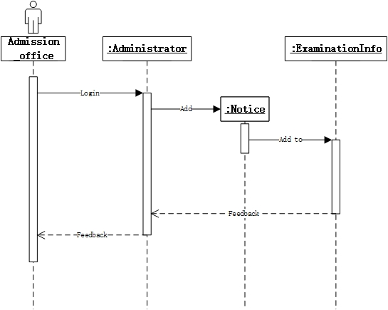
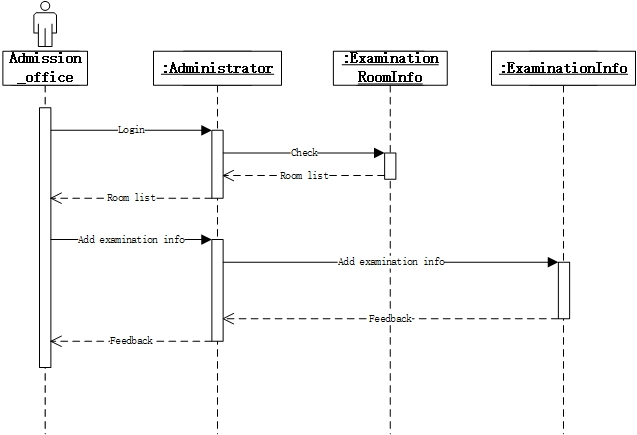
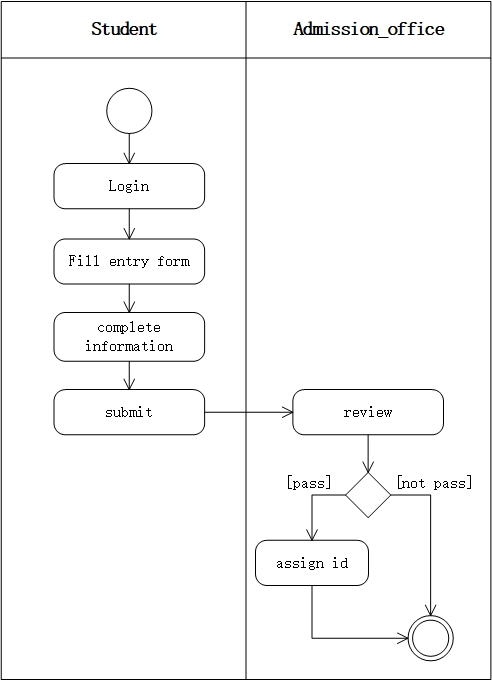

# OOA分析模型

## Ref

**需求**：[ 高校自主招生管理系统](https://github.com/SunflowerPKU/OO/blob/master/%E4%BD%9C%E4%B8%9A%E4%BA%8C--%E7%B3%BB%E7%BB%9F%E9%9C%80%E6%B1%82%E5%88%86%E6%9E%90.md)

**需求说明书**：[软件需求说明书](../hw4/软件需求说明书.md)

## 类图

## 顺序图

### 1 考生查询考试信息

### 2 考生填写报名信息 

### 3 招生办发布公告

### 4 招生办发布考场信息 

## 活动图

### 1 成绩查询活动图 

### 2 考生信息活动图

## 状态图

### 1 报名信息状态图

