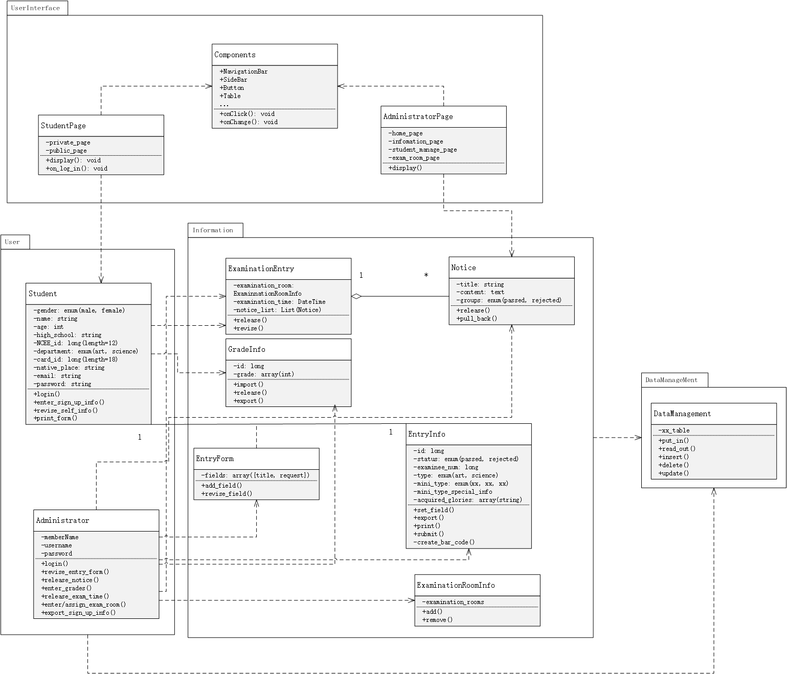
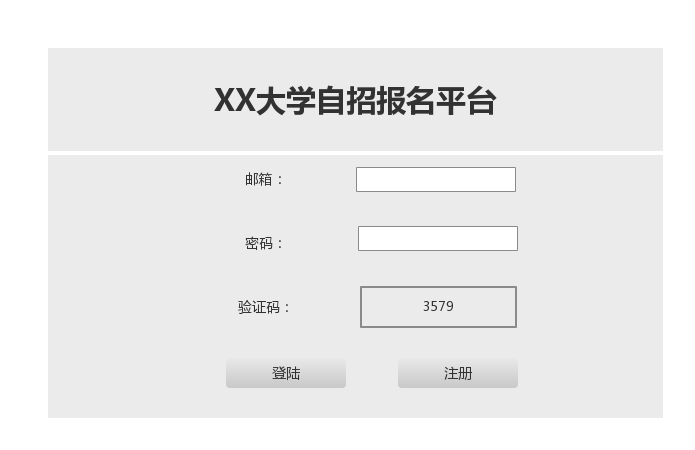
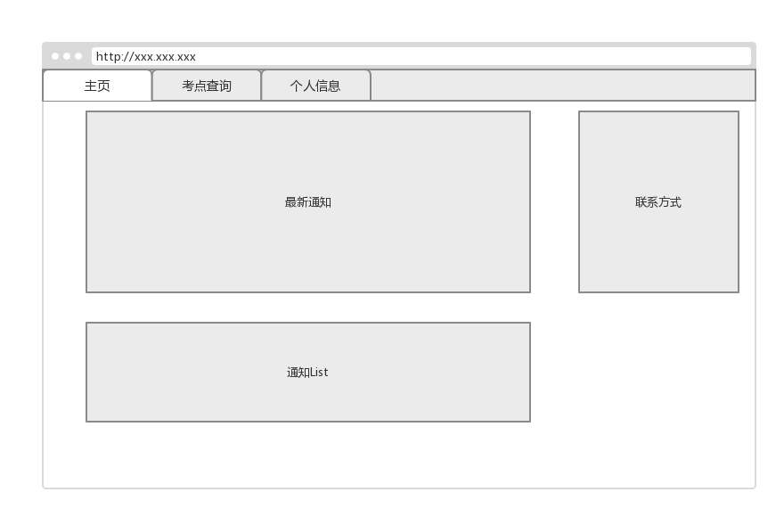
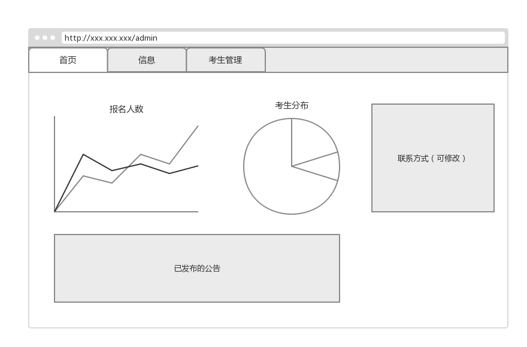
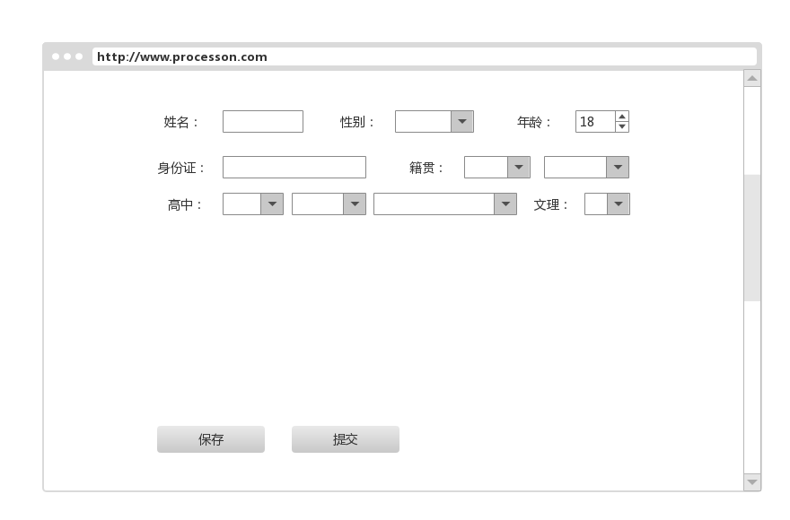

# 面向对象设计文档

## 0 相关文档

[需求陈述](https://github.com/SunflowerPKU/OO/blob/master/%E4%BD%9C%E4%B8%9A%E4%BA%8C--%E7%B3%BB%E7%BB%9F%E9%9C%80%E6%B1%82%E5%88%86%E6%9E%90.md)

[涉众分析](../hw3/作业3-高校自主招生管理系统涉众分析.md)

[需求分析](../hw4/软件需求说明书.md)

[OOA文档](../hw5/作业5-OOA分析模型.md)

## 1 类图文档

### 1.1 类图综述

### 1.2 类描述

#### 1.2.1 Student类

a) 整体说明

| 类名      | 责任                      | 一般类  | 主动性  | 引用情况 | 其它      |
| ------- | ----------------------- | ---- | ---- | ---- | ------- |
| Student | 考生的抽象，维护考生的数据结构，处理考生的请求 | 无    | 是    | 无    | 需要持久化保存 |

b) 属性说明

| 属性名          | 多重性  | 解释      | 数据类型                     | 聚合关系 | 关联关系 |
| ------------ | ---- | ------- | ------------------------ | ---- | ---- |
| gender       | 1    | 考生性别    | Enum(Male, Female)       | 无    | 无    |
| name         | 1    | 考生姓名    | String(max_length=255)   | 无    | 无    |
| age          | 1    | 考生年龄    | Int(10-30)               | 无    | 无    |
| high_school  | 1    | 考生所在高中  | String(max_length=255)   | 无    | 无    |
| NCEE_id      | 1    | 考生高考报名号 | Long(length=12)          | 无    | 无    |
| department   | 1    | 考生文理类别  | Enum(art, science)       | 无    | 无    |
| card_id      | 1    | 考生身份证   | String(length=18)        | 无    | 无    |
| native_place | 1    | 考生籍贯    | String(max_length=65535) | 无    | 无    |
| email        | 1    | 考生邮箱    | String(max_length=255)   | 无    | 无    |
| password     | 1    | 考生密码    | String(max_length=255)   | 无    | 无    |

c) 操作说明

| 操作名                | 主动性  | 多态性  | 解释     | 约束条件及其它         |
| ------------------ | ---- | ---- | ------ | --------------- |
| login              | 否    | 否    | 考生登陆   | 无               |
| enter_sign_up_info | 否    | 否    | 填写报名表  | 前置条件：考生登陆       |
| revise_self_info   | 否    | 否    | 修改个人信息 | 前置条件：考生登陆，考生未提交 |
| print_form         | 是    | 否    | 考生打印表格 | 前置条件：考生登陆，考生已提交 |

d) 关联

存在Student与EntryInfo之间的关联关系，表示一个考生对应一个EntryInfo。

e) 泛化

无泛化关系

f) 依赖

存在StudentPage到Student类的依赖关系，表示Student响应前端的请求。存在Student到ExaminationEntry和GradeInfo的依赖关系，表示考生可以查询考试信息和成绩。

#### 1.2.2 Administrator类

...

### 1.3 关联描述

| 关联名称 | 关联类型 | 所连接的类                   | 导航性                     | 排序   | 聚合   | 多重性   |
| ---- | ---- | ----------------------- | ----------------------- | ---- | ---- | ----- |
| 拥有   | 二元关联 | Student与EntryInfo       | Sudent到EntryInfo        | 否    | 否    | 1...1 |
| 组成   | 聚合   | ExaminationEntry与Notice | Notice到ExaminationEntry | 否    | 是    | *...1 |

### 1.4 泛化描述

无泛化关系

### 1.5 依赖描述

| 依赖名称 | 依赖所涉及的类名称                     | 依赖类型                |
| ---- | ----------------------------- | ------------------- |
| 无    | Student到ExaminationEntry      | <<access>>          |
| 无    | Student到GradeInfo             | <<access>>          |
| 无    | Administrator到Notice          | <<create>>          |
| 无    | Administrator到EntryForm       | <<call>>            |
| 无    | Administrator到ExaminationRoom | <<use>>             |
| 无    | Administrator到EntryInfo       | <<access>>, <<use>> |

## 2 包图文档

总共设计了四个包，分别为处理和用户交互的UserInterface包，用户相关的User包，信息相关的Information包，以及数据管理相关的DataManagement包。

### 包图中的包描述

| 包名称            | 所包含的建模元素所在的文档 | 相关的其它包                                   |
| -------------- | ------------- | ---------------------------------------- |
| UserInterface  | 类图文档          | User                                     |
| User           | 类图文档          | UserInterface, Information, DataManagement |
| Information    | 类图文档          | User, DataManagement                     |
| DataManagement | 类图文档          | Information, User                        |

## 3 用户界面

### 3.1 登陆界面

### 3.2 考生界面

### 3.3 教务界面

### 3.4 考生注册

## 4 系统环境

* 服务器
  * 系统：Ubuntu 16.04
  * 硬件：4G内存，双核处理器
* 语言：Python 3.5.2
* 框架：Django 1.11
* 数据库：PostgreSQL
* 客户端：浏览器
  * 框架：React

