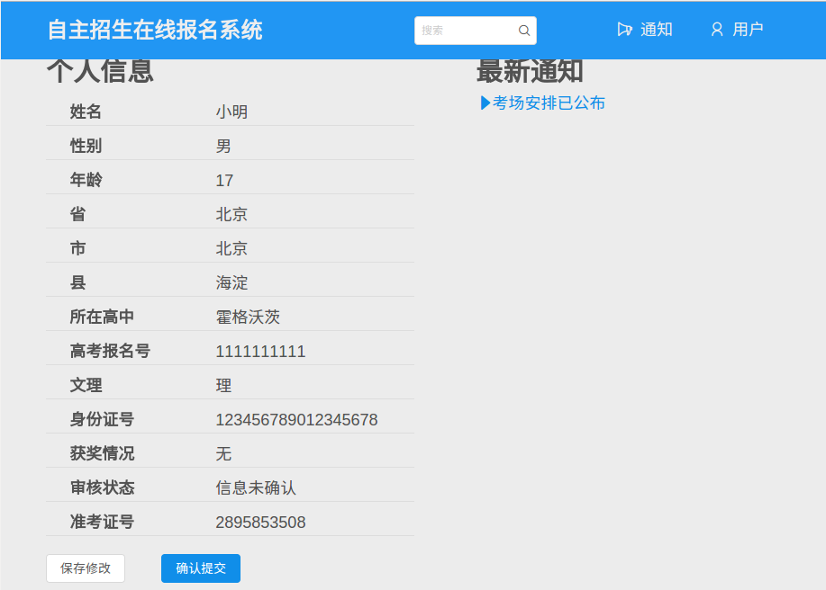
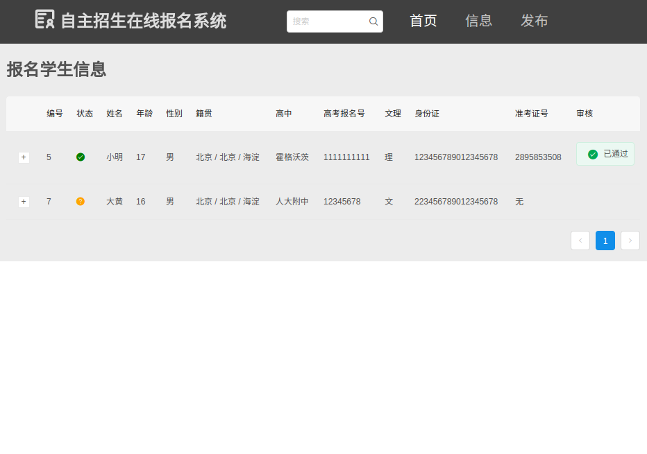

# 系统总结报告

## 0 相关文档

[需求陈述](https://github.com/SunflowerPKU/OO/blob/master/%E4%BD%9C%E4%B8%9A%E4%BA%8C--%E7%B3%BB%E7%BB%9F%E9%9C%80%E6%B1%82%E5%88%86%E6%9E%90.md)

[涉众分析](../hw3/作业3-高校自主招生管理系统涉众分析.md)

[需求分析](../hw4/软件需求说明书.md)

[OOA文档](../hw5/作业5-OOA分析模型.md)

[OOD文档](../hw6/面向对象设计文档.md)

## 1 项目概述

本项目为“高校网上自主招生管理系统”的一个子系统，包括网上报名以及后台信息管理两部分，主要用于为考生提供网上自主招生报名的接口和为招生办提供管理的接口。考生的主要功能包括网上注册、报名、管理个人信息、查看公告、查询成绩等；招生办的主要功能包括查看与审核学生信息、查看报考人员的统计信息、发布通知、成绩、和考场安排等。

## 2 实现情况

实现了考务和考生两个系统用户的相应界面及功能，采用Web应用的形式呈现。

考生端的功能包括：

- 注册账户
- 登录
- 填写报名信息
- 查看报名信息
- 修改未提交的报名信息
- 提交报名信息
- 查看通知
- 查看成绩

招生办端的功能包括：

- 管理考点
- 审核学生报名信息
- 查看报名学生的统计信息（未完成）
- 发布考生成绩
- 发布通知

## 3 界面展示

### 用户界面

### 管理员界面

## 4 开发部署

### 前端技术

* 开发语言：JavaScript
* 项目管理：npm, webpack

* 开发框架：React.js
* 框架辅助：
  * Mobx
  * React-Router
* UI框架：Ant Design

### 后端技术

* 开发语言：Python 3
* 开发框架：Django 1.10
* 数据库：SQLite