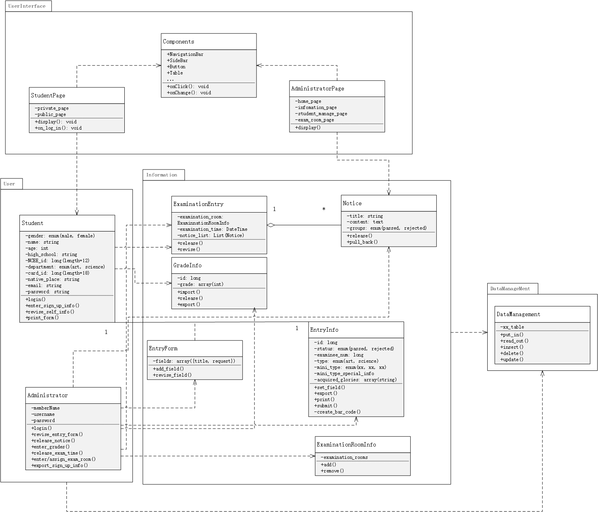
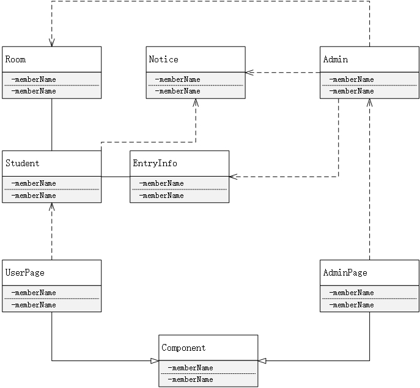

# 项目总结报告

## 0 相关文档

[需求陈述](https://github.com/SunflowerPKU/OO/blob/master/%E4%BD%9C%E4%B8%9A%E4%BA%8C--%E7%B3%BB%E7%BB%9F%E9%9C%80%E6%B1%82%E5%88%86%E6%9E%90.md)

[涉众分析](../hw3/作业3-高校自主招生管理系统涉众分析.md)

[需求分析](../hw4/软件需求说明书.md)

[OOA文档](../hw5/作业5-OOA分析模型.md)

[OOD文档](../hw6/面向对象设计文档.md)

## 1 需求概述

- 主要涉众为考生和校内考务
- 考生、考务均可登陆系统
- 考生可以进行注册
- 考生可以填写个人信息、修改未提交的个人信息
- 考生可以查看个人信息、确认个人信息，确认后无法修改
- 考务可以设置表单
- 考务可以发布通知
- 考务可以管理考场
- 考务可以查看和审核考生信息
- 考务可以录入成绩
- ***在考试开始15天前，考生可以取消报名***

## 2 设计情况

### 设计类图

### 设计总结

* 设计类图可以较好的实现需求
* 设计类图时没有很好地考虑到框架的特点
* 设计的包不合理

## 3 实现情况

### 实现类图

### 实现总结

* 实现了大部分需求，未完成的需求包括
  * 查看考生统计信息
  * 考务的登陆
  * 考务设计考生表单
* 实现类图合并了一些简单的类，而且由于没有实现考务自定义表单的功能，所以类图简化了很多

* 实现类图与设计类图存在一定差距，主要是没有考虑到框架的特性

## 4 开发技术

### 前端技术

- 开发语言：JavaScript
- 项目管理：npm, webpack

- 开发框架：React.js
- 框架辅助：
  - Mobx
  - React-Router
- UI框架：Ant Design

### 后端技术

- 开发语言：Python 3
- 开发框架：Django 1.10
- 数据库：SQLite

## 5 实现难点

* 前端路由：React-Router，API不熟悉，出现一些奇怪的跳转现象
* 跨域访问：Django的Cors插件，csrf_exempt

## 6 总结

通过本次课程，对面向对象方法的一套流程有了更全面的认识。之前只对OOA和OOD有着较为浅层次的了解，对CY方法有一定了解。

总结一下本课程的学习内容：

* 以RUP方法为例，学习了从需求捕获到开发的整个面向对象方法流程
* 以CY方法为例的类图及相关UML图与设计与优化
* 多种基于Java开发的设计模式

但是在具体的实践中，由于缺乏开发经验，从设计到开发的映射尚存在一些问题，主要是设计时对开发所用到的框架考虑不足。